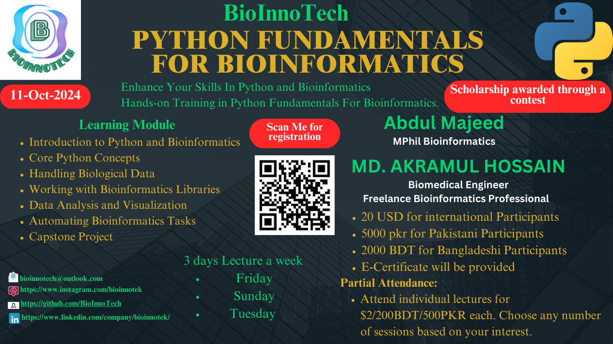
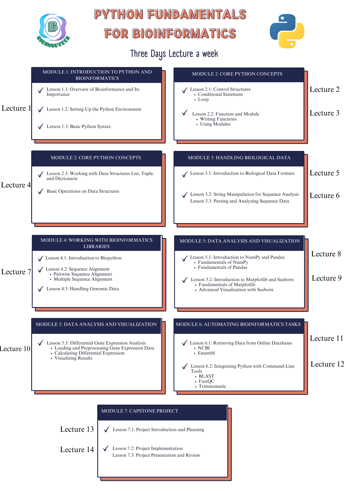

# Python-Fundamentals-for-Bioinformatics

  

## Learning Outcomes
    • Understand basic Python syntax, control structures, and functions.
    • Grasp core bioinformatics concepts and data formats (FASTA, FASTQ, GenBank, PDB, GFF/GTF, Newick, Clustal, Count Tables).
    • Apply Biopython for sequence manipulation and biological data analysis.
    • Use NumPy and Pandas to handle and analyze bioinformatics datasets.
    • Visualize biological data using Matplotlib and Seaborn.
    • Perform differential gene expression analysis and basic sequence analysis.
    • Automate bioinformatics tasks, including data retrieval from NCBI/Ensembl and running tools like BLAST, FastQC, and Trimmomatic.
    • Complete a real-world bioinformatics project, applying Python skills and collaborating in a team.

## Lectures

  

## To register for the course: [Google Form Link](https://forms.gle/UXxBQmDANquXygZM9)
